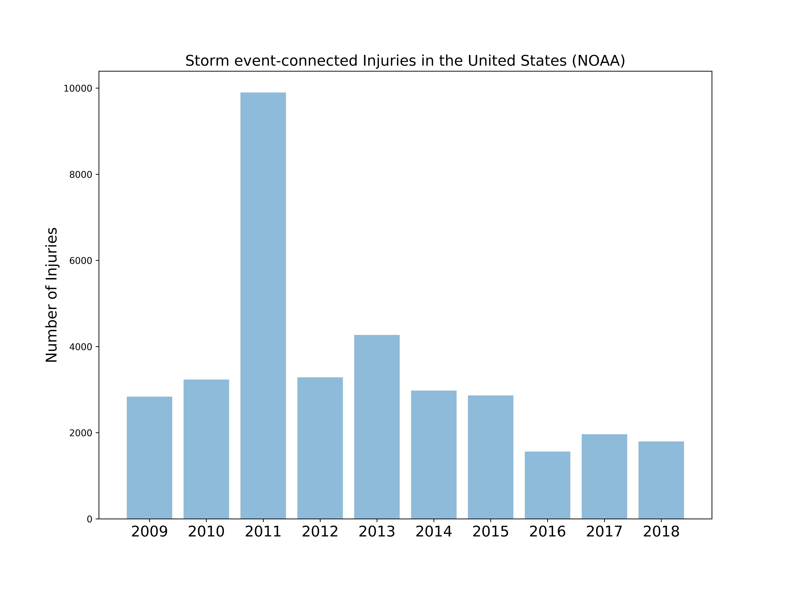
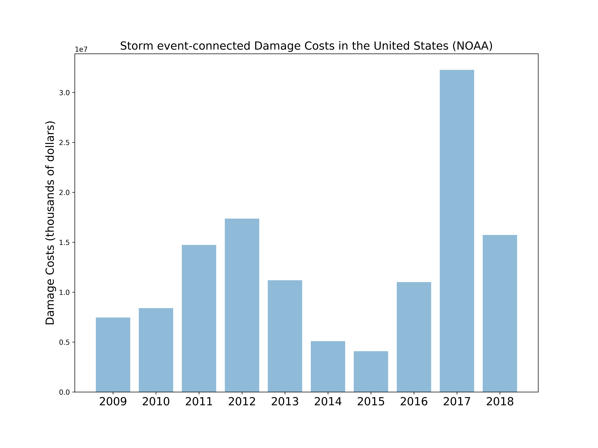

# StormEventPatternsNOAA
---
## Overview

I propose to analyze storm event data made available by the National Oceanic and Atmospheric Administration (NOAA) and develop a tool that will offer insight into damage costs, injuries, and fatalities resulting from storm events in the United States from 1950 to 2019. This tool could be used to improve public awareness about the evolution of storm events in recent history in terms of frequencies of occurrence, location(s) within the United States, and the societal impact. One motivation for this project is that much of the discussion on climate change has been focused - quite understandably - on rising temperatures and sea levels, but less so on how storm event patterns are changing. Preliminary analyses revealed no definite trends between 2009 and 2018.

## Preliminary Plots

Linear regression between the number of storm-connected injuries and year resulted in a slope of -378.5 and a coefficient of determination of 0.228.

Linear regression between the number of storm-connected damage costs and year resulted in a slope of 1072615 and a coefficient of determination of 0.158.

