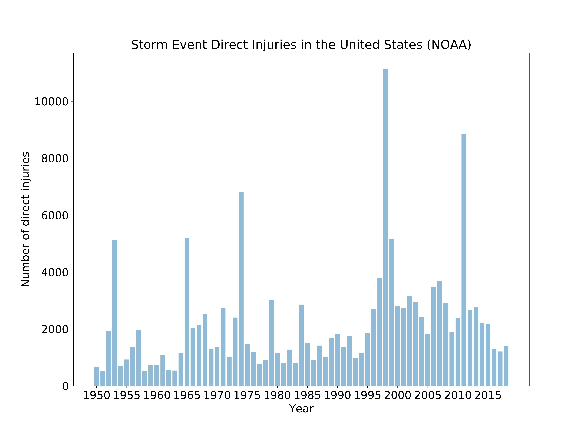
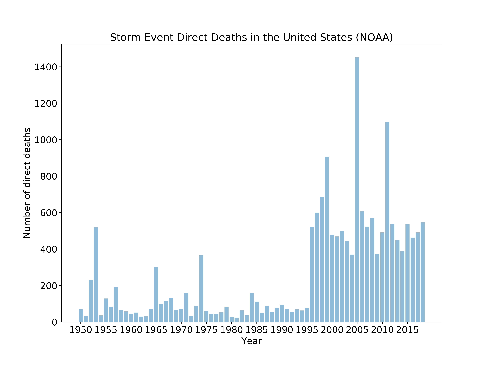
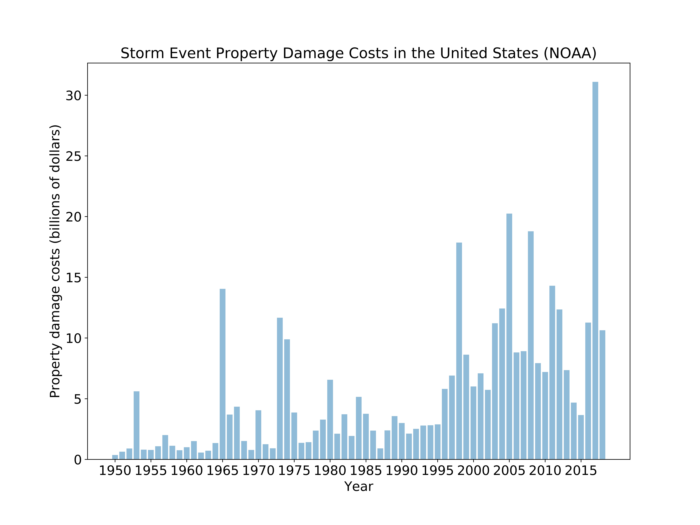
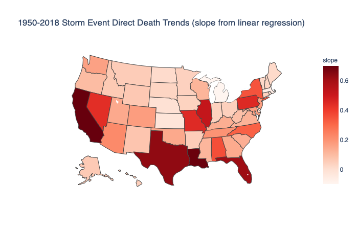
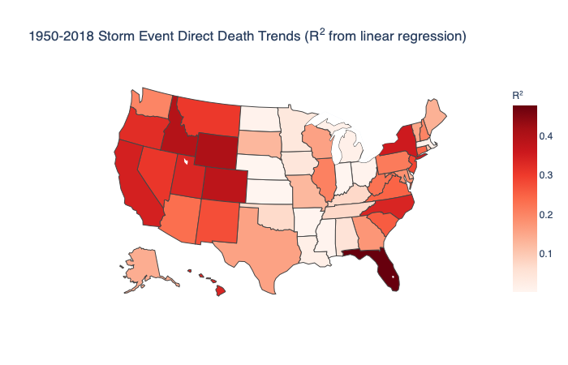
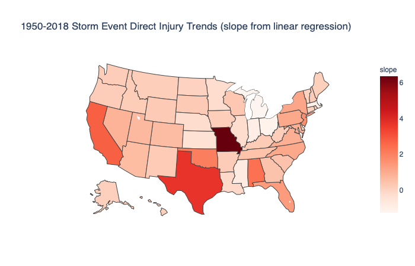
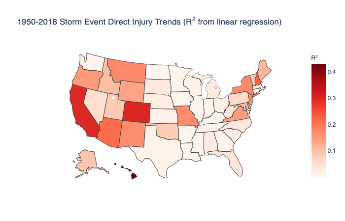
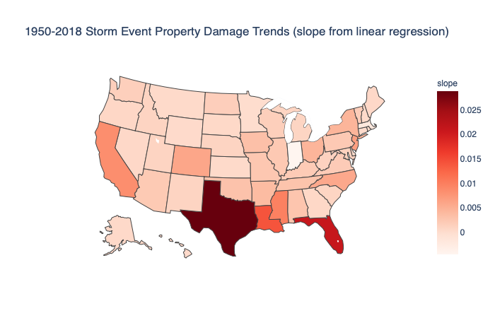
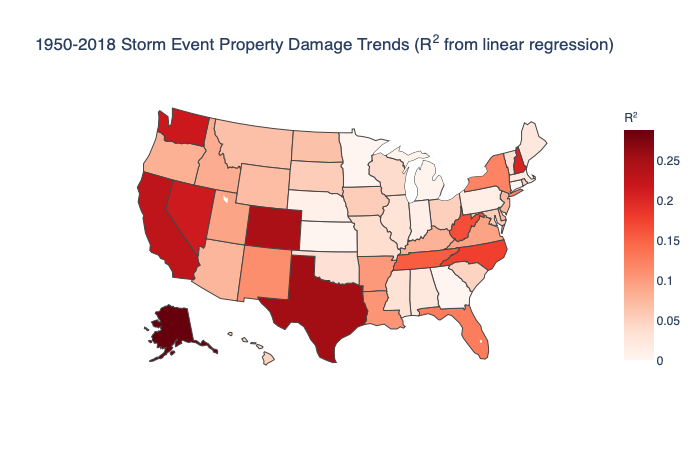

# StormEventPatternsNOAA
---
## Overview

Climate change is among the most significant issues of our time. Much of the discussion has been focused on rising temperatures and sea levels and the causative factors in these changes. Less attention has been given to storm event patterns and the attendant damage costs, injuries, and fatalities. In my view, it is easier to capture the public consciousness with the latter issues as opposed to the former. This motivated me to analyze storm event data made available by the National Oceanic and Atmospheric Administration (NOAA) and develop a tool that could improve public awareness of the issues surrounding climate change. The dataset is a little over 1GB in size.

## Preliminary Plots

While there are upward trends in injuries, fatalities and damage costs from 1950 to 2018, from bar graphs and linear regression analyses we observe more notable upward trends in fatalities and damage costs (R^2 ~ 40%) than in injuries (R^2 ~ 10%).

Linear regression of the number of storm event direct injuries and year resulted in a slope of 26.4 and a coefficient of determination of 0.082.

Linear regression of the number of storm event direct deaths and year resulted in a slope of 8.73 and a coefficient of determination of 0.384.

Linear regression of the storm event property damage (in billions of dollars) and year resulted in a slope of 0.172 and a coefficient of determination of 0.366.

From linear regression analyses on a state by state basis, I observed that California and Florida are two of the primary drivers of the rise in fatalities due to storm events from 1950 to 2018.

## Additional Plots

The following heat maps are for direct injuries and property damage (in billions of dollars).

